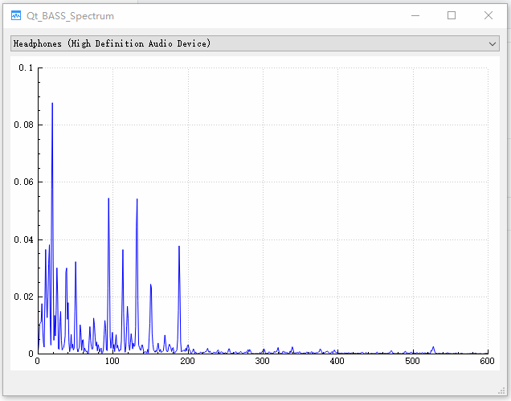

# Qt_BASS_Spectrum
Qt BASS Spectrum

Use BASS library to capture system audio and visualize the fft Spectrum.

## Tested Environment
Qt5.12 MSVC2017 64bit win10

## How to use
Use QtCreator open .pro file and congfigure and run.

## UI

